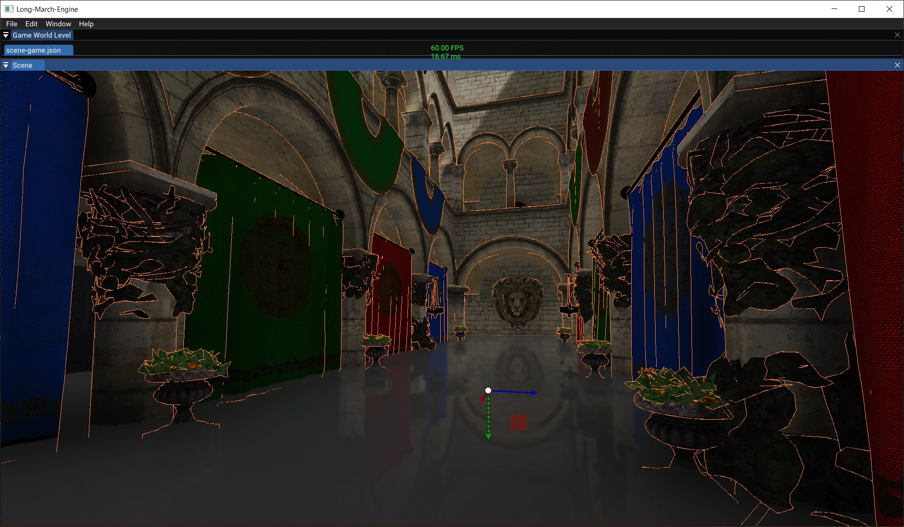
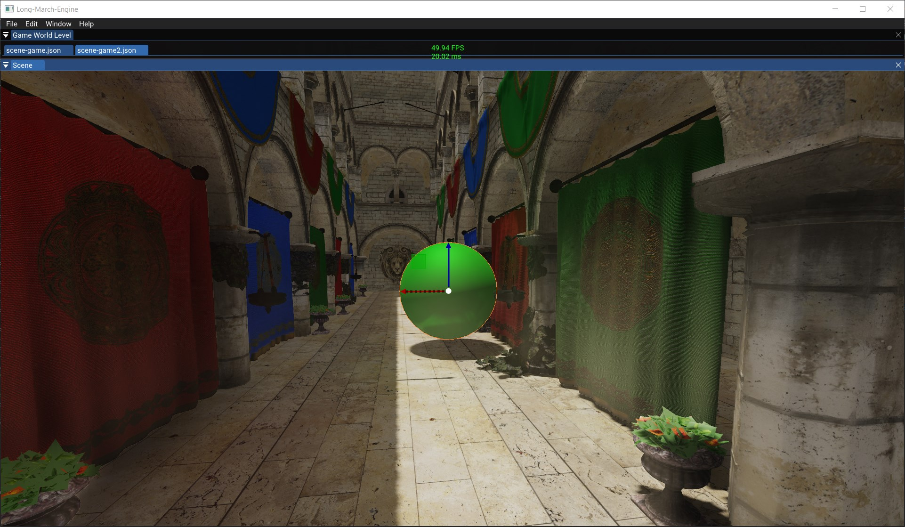
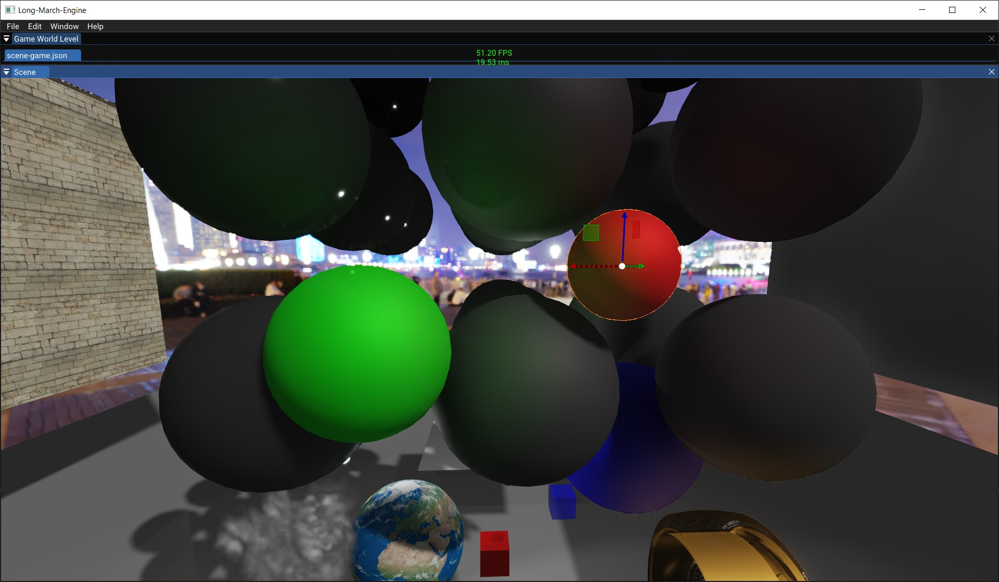
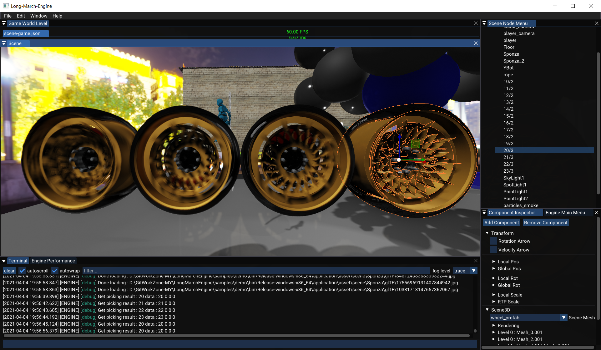
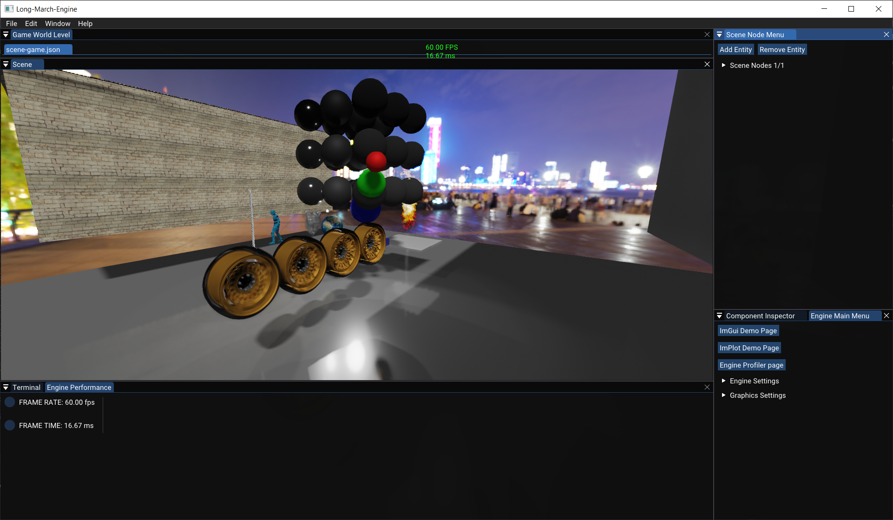
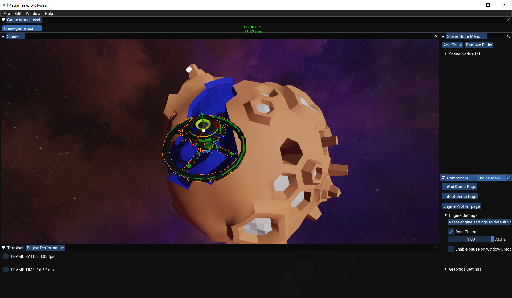
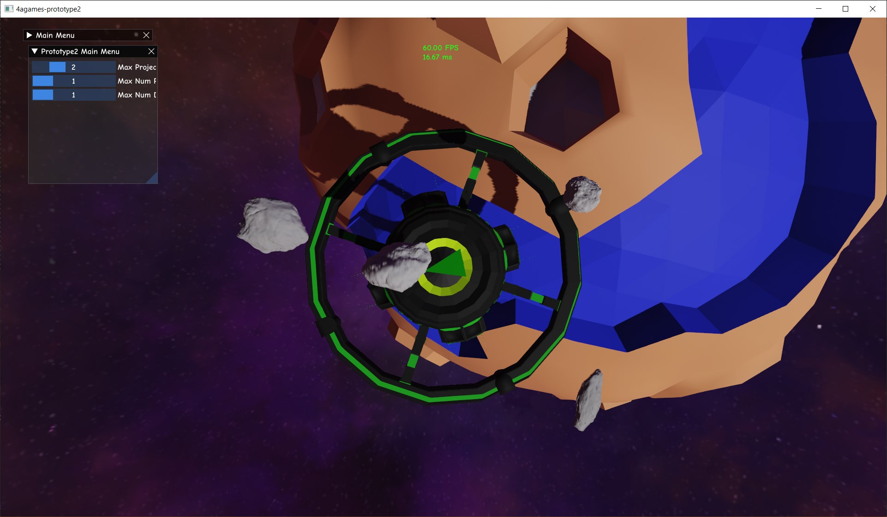

#Long March Engine Project (Engine2021)

C++ 20  
OpenGL 4.5  
VS2019 16.8  
Win10 x64  

##Startup

The project contains source of the engine, and source sample applications.

1. Use `git lfs pull` to download ./engine/vendor.zip, ./engine/asset.zip and assets for sample projects.

2. Unzip vendor.zip, asset.zip, and optionally sample asssets. Beware to not create vendor/vendor/..., just vendor/... is fine.

3. Run `generate-project.bat` script to generate a MSCV solution for the application for each sample project.

4. To create your own application, please follow the same folder structure or change path settings in engine-config.json for each application. 

Optional:  
Run index.html under engine/external/Remotery/vis/ for profiling. Beware that it may block other profiling tools such as Nvidia Nsight. 

###Sample screenshots

SSR

SSDO

Motion Blur

Editor

Asteriod

##Special Thanks
Team G.S.W.Y @ DigiPen GAM541Fa19 and Team 4a games @ DigiPen GAM550Sp20  
Dushyant Shukla  
Jie-Yang Tan  
Kyle Wang  
Taksh Goyal  

